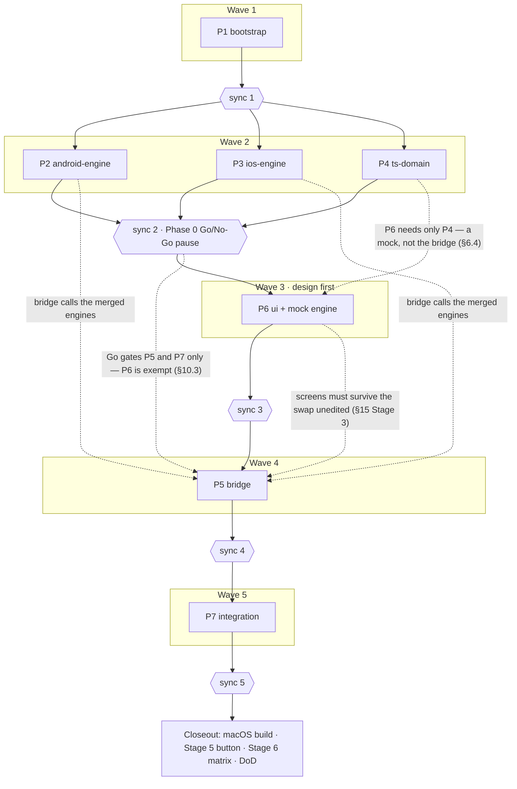

# Offline Nearby PTT MVP — execution schedule

**Spec:** docs/superpowers/specs/2026-08-13-offline-nearby-ptt-design.md
**Trunk:** feature/offline-nearby-ptt
**Run id:** 2026-08-13-offline-nearby-ptt
**Run dir:** .superpowers/waves/2026-08-13-offline-nearby-ptt/
**Models:** planner opus · executor opus · implementer sonnet · merger opus
**Dispatch model:** haiku
**Worktree setup:** pnpm install
**Task gate:** pnpm typecheck && pnpm lint && pnpm test <paths> (+ pnpm build:android when the task touched android/)
**Merge gate:** pnpm typecheck && pnpm lint && pnpm test && pnpm build:android
**Flaky:** none known — greenfield repository. Two standing environment caveats: (1) the first
Gradle / NDK / CMake / dependency downloads are slow and can time out — a download failure or
timeout is infrastructure, not a regression; re-run once before reporting. (2) Swift is never
compiled by any gate on this Windows host — a green merge gate is **not** evidence of iOS
health; iOS compilation happens only at closeout on macOS.

## Decomposition rationale

- The spec's dependency rule (radio must not depend on RN/JS) gives four naturally
  independent code territories: `android/`, `ios/`, `src/` + `specs/`, and the glue between
  them. Plans follow those territories, so no two plans in one wave write the same file.
- Wave 2 runs the two native engines and the TS domain in parallel — all three need only the
  bootstrapped project. Each engine plan is deliberately large and serial inside: transport,
  audio and PTT share one `RadioEngine` state machine, and splitting them would put two
  executors into `RadioEngine.kt`/`RadioEngine.swift` — a collision, not parallelism.
- **Sync 2 is the spec's §10.3 Go/No-Go gate.** The operator chose to pause the run there:
  the merged engines carry spike test hooks, the operator runs Phase 0 scenarios A–D on
  physical devices, and the transport-dependent waves start only on a written Go. On No-Go
  the transport sections of the spec are revised and this schedule is regenerated; nothing
  downstream is built on a failed transport. The spec's 2026-08-18 revision narrows *what*
  the gate holds, not the gate itself: it releases waves 4–5 (P5, P7); wave 3 (P6) is exempt.
- **The remaining work is inverted to run design first (spec §6.4): P6 `ui` precedes P5
  `bridge`.** The UI is engine-independent by construction — it depends on the §6.1 contract
  and nothing else, never on a Turbo Module, a transport or a device — so it does not need
  the bridge to exist. It needs a *second* implementation of the same contract, which is why
  the §6.5 mock engine is P6's first task and not a test fixture bolted on afterwards.
  Swapping mock → real is then a one-line binding change (P5), and needing UI rework to make
  that swap work is a spec violation rather than a scheduled task. The inversion is also the
  only scheduling move actually available right now: the Phase 0 **Go decision is still
  formally open** in the spike report, and per the revised §10.3 the design stage is exactly
  the work that decision does not block — a transport swap changes what fills `RadioState`,
  not the shape of `RadioState`. Waiting would idle the run; building the screens does not.
- Waves 3, 4 and 5 each carry a single plan. That is deliberate, not a failure to
  parallelise: what remains is three strictly sequential stages — screens first, the real
  engine wired underneath them second, the app assembled around both third — and each stage's
  acceptance is the next stage's precondition. It also makes the shared-file rule trivial:
  with one plan per wave there is no intra-wave collision to declare, only ownership handoffs
  across waves (`src/radio/radio.native.ts`: P4 → P6 → P5).
- Stage 5's concrete-button reverse engineering and the Stage 6 reliability matrix need
  physical hardware and are closeout items, not plans. The *generic* BLE learning flow and
  drivers are in the engine plans, and both remain gated on Go — §10.3 exempts the pairing
  *screens*, never the native learning drivers.

Host environment facts collected for the planners (agents run in fresh shells — none of this
is in the environment by default):

- Android SDK: `C:\Users\Khmil\AppData\Local\Android\Sdk` (no `ANDROID_HOME` set; no NDK or
  CMake installed yet — Gradle must fetch them, licenses are accepted).
- JDK: Android Studio JBR at `C:\Program Files\Android\Android Studio\jbr` (OpenJDK 25 —
  P1 must verify Gradle compatibility and pin `org.gradle.java.home` / `sdk.dir` so
  `pnpm build:android` runs in a fresh shell with no env setup).
- Node v26.5.0, pnpm 10.14.0. No macOS available: iOS code is review-verified only.

## Plans

### P1 `bootstrap` — wave 1, track A
- [x] planned   → docs/superpowers/plans/2026-08-13-p1-bootstrap.md
- [x] executed  → branch plan/p1-bootstrap · worktree .claude/worktrees/p1-bootstrap
- [x] merged    → sync 1

**Owns:** bare React Native project init (New Architecture, TypeScript) with pnpm
(`.npmrc` `node-linker=hoisted`); the toolchain the gates run on — `typecheck`, `lint`,
`test`, and `build:android` scripts, where `build:android` pins `sdk.dir`
(android/local.properties) and `org.gradle.java.home` (Android Studio JBR) so it works in a
fresh shell; Gradle↔JDK 25 compatibility verification; ESLint/Prettier/Jest config; errore
and Lingui installed and configured (metro transformer, empty `en`/`ru` catalogs,
`loadAndActivate` scaffold); every §11 permission declaration in AndroidManifest and
Info.plist (including UIBackgroundModes and the push-to-talk entitlement stub); the §17
directory skeleton; **all JS runtime dependencies from the spec pre-installed** (Reatom
v1001, @lingui/*, errore) so later plans do not edit package.json.
**Not here:** any radio logic → P2/P3 · TS types and Reatom model → P4 · Turbo Module glue
→ P5 · screens → P6.
**Needs:** — (first plan).
**Spec sections:** §5, §11, §12.2, §17.
**Model override:** —

### P2 `android-engine` — wave 2, track A
- [x] planned   → docs/superpowers/plans/2026-08-13-p2-android-engine.md
- [x] executed  → branch plan/p2-android-engine · worktree .claude/worktrees/p2-android-engine
- [x] merged    → sync 2

**Owns:** the entire Android radio: `RadioEngine.kt` state machine (§6.3 operations, 120 s
safety cap); `NearbyManager.kt` (P2P_CLUSTER, simultaneous advertise+discover, auto-accept,
`hello` version gate, `tx-start`/`tx-stop` control messages, one STREAM per transmission
fanned out per peer, fully native reconnect with backoff); `AudioEngine.kt` (AudioRecord
VOICE_COMMUNICATION 16 kHz mono, embedded libopus via NDK wrapper, 20 ms ~24 kbps frames,
2–3-frame jitter buffer, mixing of concurrent streams, AudioTrack playback, codec params in
one config); `RadioForegroundService.kt` (foreground-service types microphone +
connectedDevice, notification localized via strings.xml en/ru); `PttManager.kt` with
BleGattPttDriver / HidPttDriver / MediaButtonPttDriver, SharedPreferences binding
persistence, native learning-flow support (scan, capture notify characteristic,
pressed/released values); Gradle/NDK/CMake build config for libopus; native spike test
hooks sufficient to drive Phase 0 scenarios A–D without React Native.
**Not here:** iOS mirror → P3 · TS layer → P4 · JS bridge → P5 · the concrete purchased
button's protocol → closeout (Stage 5, physical hardware).
**Needs:** P1.
**Spec sections:** §6, §6.3, §7, §8, §9, §10.1, §13, §15 (Phase 0 + Stage 1).
**Model override:** —

### P3 `ios-engine` — wave 2, track B
- [x] planned   → docs/superpowers/plans/2026-08-13-p3-ios-engine.md
- [x] executed  → branch plan/p3-ios-engine · worktree .claude/worktrees/p3-ios-engine
- [x] merged    → sync 2

**Owns:** the entire iOS radio: `RadioEngine.swift` (same state machine and safety cap);
`NearbyManager.swift` on Google's NearbyConnections Swift library (Podfile/SPM dependency);
`AudioEngine.swift` (AVAudioEngine capture/playback, embedded libopus Swift module, same
codec config shape); `BackgroundManager.swift` (PushToTalk `PTChannelManager`,
`requestBeginTransmitting()` flow, audio-session activation via PushToTalk,
bluetooth-central wake-ups); `PttManager.swift` + BleGattPttDriver (CoreBluetooth,
background-capable), UserDefaults binding persistence, native learning-flow support;
localized native strings (InfoPlist.strings, Localizable.strings incl. the PTT channel
name); native spike test hooks for Phase 0 scenarios A–D.
**Not here:** Android mirror → P2 · TS layer → P4 · JS bridge → P5 · concrete button →
closeout. **Verification caveat:** no gate on this host compiles Swift — the executor's
code review is the only pre-closeout check; the first real compile is the closeout macOS
build.
**Needs:** P1.
**Spec sections:** §6, §6.3, §7, §8, §9, §10.2, §13, §15 (Phase 0 + Stage 1).
**Model override:** —

### P4 `ts-domain` — wave 2, track C
- [x] planned   → docs/superpowers/plans/2026-08-13-p4-ts-domain.md
- [x] executed  → branch plan/p4-ts-domain · worktree .claude/worktrees/p4-ts-domain
- [x] merged    → sync 2

**Owns:** the whole TypeScript domain: `radio.types.ts` (`RadioState`, events),
`ptt.types.ts` (`PttBinding`), `specs/NativeRadio.ts` Turbo Module spec (§6.1 contract
verbatim); `radio.native.ts` typed wrapper with errore-style `Error | T` returns and event
subscription; `radio.model.ts` + `app.model.ts` — Reatom v1001 mirror (`atom.extend` with
`sync`/`start`/`pressPtt`/`releasePtt`, `screenState` computed, resume re-sync per §6.2);
control-message codec in TS; unit tests for the codec, the model, and `PttBinding`
parsing (§16).
**Not here:** native engines → P2/P3 · TurboModule registration and codegen wiring → P5 ·
screens → P6 · app-entry wiring → P7.
**Needs:** P1.
**Spec sections:** §6.1, §6.2, §7 (message shapes), §13, §16.
**Model override:** —

### P6 `ui` — wave 3, track A
- [ ] planned   → docs/superpowers/plans/2026-08-13-p6-ui.md
- [ ] executed  → branch plan/p6-ui · worktree .claude/worktrees/p6-ui
- [ ] merged    → sync 3

**Owns, first — the mock engine (§6.5):** `src/radio/radio.native.mock.ts`, a complete,
deterministic TypeScript implementation of the §6.1 contract — every method of
`specs/NativeRadio.ts` including the candidate-selection step the §9.3 pairing flow needs,
both `stateChanged` and `error` events, an injectable clock, no randomness and no real I/O —
driven by the seven named scenarios `happy`, `solo`, `pairing-success`, `pairing-empty`,
`button-lost`, `engine-error`, `onboarding`; the `RADIO_BACKEND` build-time flag
(`mock` | `native`) — `babel-plugin-transform-inline-environment-variables` added as a
devDependency and wired into the Babel config so the value is inlined, the backend resolved
through the **existing `createRadioNative(resolve)` seam** in `src/radio/radio.native.ts`
(this file transfers from P4's ownership to P6 for this wave) so that release builds are
always `native` and the mock module is dropped from release bundles, with the dev default
`mock` until P5 flips it; one `DevSettings.addMenuItem` entry per scenario under `__DEV__`
for live switching, while tests set the scenario directly. Every scenario must honour
`start()` / `stop()`: `stop()` from any point yields `status: 'off'` with peers cleared, `start()`
re-enters the scenario's script — that is what makes the power toggle exercisable against the mock
(§6.5).

**Owns, also — the §6.1 `status: 'off'` contract extension.** The spec's `RadioState.status` is now
`'off' | 'starting' | 'ready' | 'error'` — the state before `start()` and after `stop()`, which is
what the power toggle needs to render. Extending it is **contract-extension work under §6.4** ("a
fact the contract does not carry means the contract is extended, not reached around"), not a
UI-local flag, so it happens in the contract, not in a screen. Concretely, this wave touches three
further P4-built files and they are P6's for it: `src/radio/radio.types.ts` (the `RadioStatus` and
`ScreenState` unions), `specs/NativeRadio.ts` (the Codegen-facing mirror), and
`src/radio/radio.model.ts` (the `off` branch of the `screenState` computed — the model already
carries `start()` / `stop()`, so the toggle needs no new action). The mock is the implementation
that fills `'off'`; the real bridge maps it in P5.

**Owns, then — every screen,** against the Reatom model only (no direct native calls):
`RadioScreen` with the five `screenState` states (`off`, `searching`, `ready`, `transmitting`,
`receiving`), a full-screen PTT touch area, and the **radio power toggle as a first-class
main-screen control** — not a settings item — driving the model's `start()` / `stop()` (§6.2);
`SettingsScreen` ("PTT button" section, configured / not configured); the four-step pairing
flow (scan → pick → learn → saved); onboarding (three permission screens + done), with the
runtime-permission gateway behind a port of the same shape so the mock can answer it (§6.4);
the visual direction from the Claude Design project "Offline Nearby PTT" (dark radio-hardware
aesthetic, TX red / RX green / learning amber, Oswald + IBM Plex Mono bundled as assets,
`prefers-reduced-motion` respected); all UI copy through Lingui macros with filled `en`/`ru`
catalogs; error-state screen with restart action.

*On the power toggle, for the planner:* the always-hot architecture keeps the microphone and the
audio session live for as long as radio mode is on, so the battery cost is inherent to the design
and the user needs one deliberate way to cut it. Recorded as an approved decision in spec §5 and
sourced from the product note "radio power switch is a design requirement (verbatim intent)" in
`docs/superpowers/specs/2026-08-13-phase0-spike-report.md`. Its visual form is now designed in
the project (§12.1, 2026-08-18): a hardware-style IEC power key — in `off` the whole screen is
the on-switch, when the radio is on the key mirrors the settings gear in the opposite corner
(receding during transmit/receive), and turning off is a press-and-hold;
first-class-on-the-main-screen (never a settings item) is fixed and not open to reinterpretation,
and `off` is a full main-screen state rather than a dimmed `searching`.
**Not here:** the Turbo Module and the dev-default flip → P5 · app entry, navigation glue and
runtime permission sequencing against the real OS prompts → P7 · native learning logic →
merged P2/P3. Per §6.4 no screen may import `radio.native.ts`, `TurboModuleRegistry`, or any
API that only behaves correctly on a device; a fact a screen needs but the contract does not
carry means the contract is extended, not reached around.
**Acceptance beyond the gates — spec §15 Stage 2, with no devices, no native code,
`RADIO_BACKEND=mock`:**
- all five main-screen states are reachable and visually distinct;
- the power toggle turns the radio off — the `off` state is reachable from any scenario and is
  visually distinct — and back on, returning to the scenario's normal flow;
- the pairing flow completes end-to-end on `pairing-success`, and its empty / retry path on
  `pairing-empty`;
- onboarding walks through every step, including a denied permission;
- the error state appears on `engine-error` and its restart action returns the UI to
  `starting`;
- all of the above in **both locales** (`en`/`ru`), with `prefers-reduced-motion` honoured.

On-device end-to-end behaviour is deliberately **not** asserted here — it is P7's (§15
Stage 4).

**Needs:** P4. **Not gated on the Go decision** — per the revised §10.3 UI and design work is
explicitly exempt, so this wave runs while the decision is still open. (Does not need P5 —
the UI talks to the model, and the mock is the engine underneath it.)
**Spec sections:** §6.4, §6.5, §12, §12.1, §12.2, §13, §15 Stage 2.
**Model override:** —

### P5 `bridge` — wave 4, track A
- [ ] planned   → docs/superpowers/plans/2026-08-13-p5-bridge.md
- [ ] executed  → branch plan/p5-bridge · worktree .claude/worktrees/p5-bridge
- [ ] merged    → sync 4

**Owns:** the `RadioNative` Turbo Module made real on both platforms: codegen config in
package.json; Kotlin module + package registration (MainApplication) calling into the
merged Android engine; Swift/ObjC++ module registration calling into the merged iOS engine;
the `stateChanged`/`error` event stream from engine to JS; adjustments to
`src/radio/radio.native.ts` so the wrapper matches the real module, **and the flip of the dev
default `RADIO_BACKEND` binding from `mock` to `native`** in that same file (§6.5) — the file
transfers from P6's ownership to P5 for this wave. `RADIO_BACKEND=mock` must keep working
after the flip: it stays the way design work, demos and screenshots run.
The real bridge must map the engines' stopped state (before `start()`, after `stop()`) to
`status: 'off'` per the extended §6.1 contract, so the merged power toggle behaves against the real
engines exactly as it did against the mock.
**Not here:** engine internals → merged P2/P3 (touch only what the bridge exposes) · screens
and the mock engine → merged P6 · app bootstrap wiring → P7.
**Acceptance beyond the gates:** spec §15 Stage 3 — JS drives a full session against the real
engines, **and the merged Stage 2 screens do it without a single UI edit**. A UI change needed
to make the real binding work is a §6.4 violation and is reported as one, not absorbed.
**Needs:** P2, P3, P4, P6, Go decision (sync 2). P6 comes first so the screens this wave must
not break already exist and the no-UI-edit acceptance is checkable.
**Spec sections:** §6.1, §6.4, §6.5, §15 Stage 3.
**Model override:** —

### P7 `integration` — wave 5, track A
- [ ] planned   → docs/superpowers/plans/2026-08-13-p7-integration.md
- [ ] executed  → branch plan/p7-integration · worktree .claude/worktrees/p7-integration
- [ ] merged    → sync 5

**Owns:** the app as a whole: app entry (`i18n.loadAndActivate` with system locale + en
fallback, engine event subscription into the Reatom model, `radio.start()`, AppState resume
re-sync); navigation glue between Radio / Settings / pairing / onboarding; first-launch
permission sequencing against the real OS prompts behind P6's onboarding screens (per §11
order, including the `ACCESS_BACKGROUND_LOCATION` step §11 records as still open — Data
Safety disclosure plus Android's two-step "Allow all the time" Settings redirect); §11
cross-check of every manifest/plist declaration against what the merged code actually uses;
JS-layer smoke tests of the assembled app; README with run instructions for both platforms.
**Not here:** everything else is merged — fix only wiring; behavioral fixes in engines,
bridge or screens are reported, not silently absorbed.
**Acceptance beyond the gates:** spec §15 Stage 4 — **full flow on both platforms from
install to talking**. This on-device end-to-end acceptance moved here from the old UI stage
when the spec was re-cut design-first; it is precisely the acceptance P6 deliberately does
not carry.
**Needs:** P5 (P6 is already merged at sync 3).
**Spec sections:** §4, §6.2, §11, §12, §15 Stage 4.
**Model override:** —

## Sync 1 — after P1
**Merges:** P1.
**Regenerate, never text-merge:** pnpm-lock.yaml → `pnpm install`, committed separately.
**Append-only surfaces:** none.
**Gate:** merge gate green (this sync is where the gate scripts come into existence — the
merger verifies they exist and pass, including `pnpm build:android` in a fresh shell).

## Sync 2 — after P2, P3, P4 · **Phase 0 Go/No-Go**
**Merges:** P2, P3, P4.
**Regenerate, never text-merge:** pnpm-lock.yaml → `pnpm install`, committed separately.
**Append-only surfaces:** none — the three plans own disjoint directories; a conflict here
is a decomposition violation and is reported as one.
**Gate:** merge gate green, **and then the run pauses**. The operator builds the spike on
physical devices (Android + iPhone, internet off, screens locked), runs §15 Phase 0
scenarios A–D using the engines' native test hooks, and records the outcome in
`docs/superpowers/specs/2026-08-13-phase0-spike-report.md` with an explicit **Go** or
**No-Go**. On No-Go: the spec's transport sections (§7, §10) are revised and this schedule is
regenerated — P5 and P7 as written assume Nearby Connections.
**Gate scope — revised 2026-08-18.** As executed, this pause held *every* downstream wave,
because the schedule then ran the bridge first and there was nothing downstream that was not
transport-dependent. The spec's §10.3 revision narrows what the pause blocks: the Go decision
now releases **waves 4 and 5** (P5 bridge, P7 integration) only, and **wave 3 (P6 design) is
exempt** — by §6.4 the UI depends on the §6.1 contract alone and by §6.5 it is accepted
against the mock, so a transport replacement changes what fills `RadioState`, not its shape.
The record of the pause above stands as it happened; only its downstream scope changed. The
decision itself is still open in the spike report as of this revision, which is why wave 3 is
the wave that runs next.

## Sync 3 — after P6
**Merges:** P6.
**Regenerate, never text-merge:** pnpm-lock.yaml → `pnpm install`, committed separately —
P6 adds `babel-plugin-transform-inline-environment-variables` as a devDependency, so the
lockfile *will* move at this sync and must be regenerated, never text-merged; Lingui catalogs
(`*.po`) on conflict → `pnpm lingui extract`, then re-fill `ru`.
**Declared shared surface:** package.json — P6 adds the Babel devDependency (§6.5) and may
add font/asset config. This relaxes P1's "later plans do not edit package.json" invariant by
design: the `RADIO_BACKEND` flag mechanism needs a build-time plugin that did not exist when
P1 pre-installed the spec's runtime dependencies. Resolution is union of the changes followed
by lockfile regeneration. `babel.config.js` and `src/radio/radio.native.ts` are P6's alone
for this wave.
**Gate:** merge gate green. One plan in the wave, so there is no cross-plan conflict to
resolve — anything beyond trunk drift here is a merge-mechanics problem, not a decomposition
violation.

## Sync 4 — after P5
**Merges:** P5.
**Regenerate, never text-merge:** pnpm-lock.yaml → `pnpm install`, committed separately.
**Declared shared surface:** package.json — P5 adds `codegenConfig` alongside P6's already
merged Babel devDependency; union, then regenerate the lockfile.
`src/radio/radio.native.ts` is P5's for this wave (ownership transferred from P6).
**Gate:** merge gate green, **plus the §15 Stage 3 no-UI-edit check** — the merger confirms
P5's branch changed no screen. A UI edit needed to make the real binding work is a §6.4
violation: it is reported before the merge is accepted, not quietly merged.

## Sync 5 — after P7
**Merges:** P7.
**Regenerate, never text-merge:** pnpm-lock.yaml → `pnpm install`, committed separately.
**Append-only surfaces:** none.
**Gate:** merge gate green.

## Closeout

- [ ] Full merge gate on trunk from a clean checkout and fresh `pnpm install`.
- [ ] macOS build: `pod install` + Xcode build with the `com.apple.developer.push-to-talk`
      entitlement and provisioning — the first time any Swift in this project compiles.
      Compile fallout is fixed here or spawns a follow-up plan.
- [ ] Phase 0 spike report archived and referenced (written at the sync 2 pause).
- [ ] Stage 5: reverse-engineer the purchased button (nRF Connect, GATT inspection); run
      the learning flow end-to-end with the real button; if it is HID-only, record the R2
      fallback (button stays Android-only, a GATT-capable button is purchased for iOS).
- [ ] Stage 6 reliability matrix on physical devices: 5 min / 30 min / multi-hour locked;
      PTT-button loss + reconnect; peer loss + reconnect; incoming call; BT headphones;
      route switch.
- [ ] Definition of Done (§4) checked line by line; `lingui extract` reports no missing
      `ru` translations.

## Diagram

