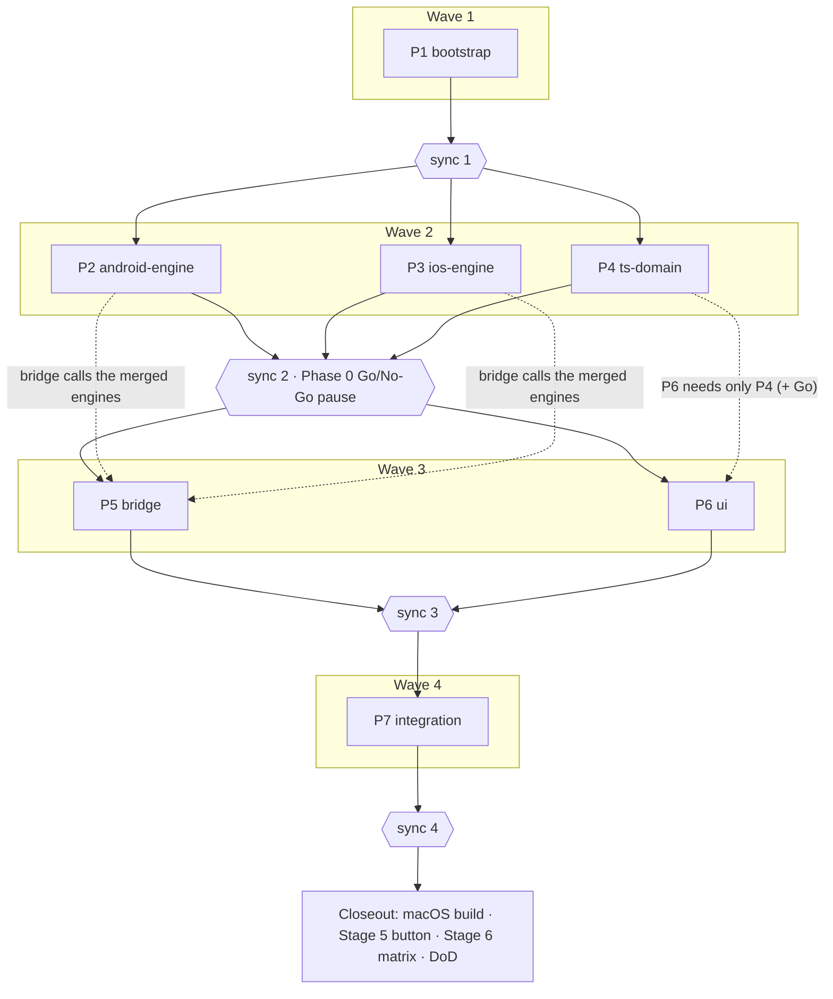

# Offline Nearby PTT MVP — execution schedule

**Spec:** docs/superpowers/specs/2026-08-13-offline-nearby-ptt-design.md
**Trunk:** feature/offline-nearby-ptt
**Run id:** 2026-08-13-offline-nearby-ptt
**Run dir:** .superpowers/waves/2026-08-13-offline-nearby-ptt/
**Models:** planner opus · executor opus · implementer sonnet · merger opus
**Dispatch model:** haiku
**Worktree setup:** pnpm install
**Task gate:** pnpm typecheck && pnpm lint && pnpm test <paths> (+ pnpm build:android when the task touched android/)
**Merge gate:** pnpm typecheck && pnpm lint && pnpm test && pnpm build:android
**Flaky:** none known — greenfield repository. Two standing environment caveats: (1) the first
Gradle / NDK / CMake / dependency downloads are slow and can time out — a download failure or
timeout is infrastructure, not a regression; re-run once before reporting. (2) Swift is never
compiled by any gate on this Windows host — a green merge gate is **not** evidence of iOS
health; iOS compilation happens only at closeout on macOS.

## Decomposition rationale

- The spec's dependency rule (radio must not depend on RN/JS) gives four naturally
  independent code territories: `android/`, `ios/`, `src/` + `specs/`, and the glue between
  them. Plans follow those territories, so no two plans in one wave write the same file.
- Wave 2 runs the two native engines and the TS domain in parallel — all three need only the
  bootstrapped project. Each engine plan is deliberately large and serial inside: transport,
  audio and PTT share one `RadioEngine` state machine, and splitting them would put two
  executors into `RadioEngine.kt`/`RadioEngine.swift` — a collision, not parallelism.
- **Sync 2 is the spec's §10.3 Go/No-Go gate.** The operator chose to pause the run there:
  the merged engines carry spike test hooks, the operator runs Phase 0 scenarios A–D on
  physical devices, and waves 3–4 start only on a written Go. On No-Go the transport
  sections of the spec are revised and this schedule is regenerated; nothing downstream is
  built on a failed transport.
- Stage 5's concrete-button reverse engineering and the Stage 6 reliability matrix need
  physical hardware and are closeout items, not plans. The *generic* BLE learning flow and
  drivers are in the engine plans.

Host environment facts collected for the planners (agents run in fresh shells — none of this
is in the environment by default):

- Android SDK: `C:\Users\Khmil\AppData\Local\Android\Sdk` (no `ANDROID_HOME` set; no NDK or
  CMake installed yet — Gradle must fetch them, licenses are accepted).
- JDK: Android Studio JBR at `C:\Program Files\Android\Android Studio\jbr` (OpenJDK 25 —
  P1 must verify Gradle compatibility and pin `org.gradle.java.home` / `sdk.dir` so
  `pnpm build:android` runs in a fresh shell with no env setup).
- Node v26.5.0, pnpm 10.14.0. No macOS available: iOS code is review-verified only.

## Plans

### P1 `bootstrap` — wave 1, track A
- [x] planned   → docs/superpowers/plans/2026-08-13-p1-bootstrap.md
- [x] executed  → branch plan/p1-bootstrap · worktree .claude/worktrees/p1-bootstrap
- [x] merged    → sync 1

**Owns:** bare React Native project init (New Architecture, TypeScript) with pnpm
(`.npmrc` `node-linker=hoisted`); the toolchain the gates run on — `typecheck`, `lint`,
`test`, and `build:android` scripts, where `build:android` pins `sdk.dir`
(android/local.properties) and `org.gradle.java.home` (Android Studio JBR) so it works in a
fresh shell; Gradle↔JDK 25 compatibility verification; ESLint/Prettier/Jest config; errore
and Lingui installed and configured (metro transformer, empty `en`/`ru` catalogs,
`loadAndActivate` scaffold); every §11 permission declaration in AndroidManifest and
Info.plist (including UIBackgroundModes and the push-to-talk entitlement stub); the §17
directory skeleton; **all JS runtime dependencies from the spec pre-installed** (Reatom
v1001, @lingui/*, errore) so later plans do not edit package.json.
**Not here:** any radio logic → P2/P3 · TS types and Reatom model → P4 · Turbo Module glue
→ P5 · screens → P6.
**Needs:** — (first plan).
**Spec sections:** §5, §11, §12.2, §17.
**Model override:** —

### P2 `android-engine` — wave 2, track A
- [ ] planned   → docs/superpowers/plans/2026-08-13-p2-android-engine.md
- [ ] executed  → branch plan/p2-android-engine · worktree .claude/worktrees/p2-android-engine
- [ ] merged    → sync 2

**Owns:** the entire Android radio: `RadioEngine.kt` state machine (§6.3 operations, 120 s
safety cap); `NearbyManager.kt` (P2P_CLUSTER, simultaneous advertise+discover, auto-accept,
`hello` version gate, `tx-start`/`tx-stop` control messages, one STREAM per transmission
fanned out per peer, fully native reconnect with backoff); `AudioEngine.kt` (AudioRecord
VOICE_COMMUNICATION 16 kHz mono, embedded libopus via NDK wrapper, 20 ms ~24 kbps frames,
2–3-frame jitter buffer, mixing of concurrent streams, AudioTrack playback, codec params in
one config); `RadioForegroundService.kt` (foreground-service types microphone +
connectedDevice, notification localized via strings.xml en/ru); `PttManager.kt` with
BleGattPttDriver / HidPttDriver / MediaButtonPttDriver, SharedPreferences binding
persistence, native learning-flow support (scan, capture notify characteristic,
pressed/released values); Gradle/NDK/CMake build config for libopus; native spike test
hooks sufficient to drive Phase 0 scenarios A–D without React Native.
**Not here:** iOS mirror → P3 · TS layer → P4 · JS bridge → P5 · the concrete purchased
button's protocol → closeout (Stage 5, physical hardware).
**Needs:** P1.
**Spec sections:** §6, §6.3, §7, §8, §9, §10.1, §13, §15 (Phase 0 + Stage 1).
**Model override:** —

### P3 `ios-engine` — wave 2, track B
- [ ] planned   → docs/superpowers/plans/2026-08-13-p3-ios-engine.md
- [ ] executed  → branch plan/p3-ios-engine · worktree .claude/worktrees/p3-ios-engine
- [ ] merged    → sync 2

**Owns:** the entire iOS radio: `RadioEngine.swift` (same state machine and safety cap);
`NearbyManager.swift` on Google's NearbyConnections Swift library (Podfile/SPM dependency);
`AudioEngine.swift` (AVAudioEngine capture/playback, embedded libopus Swift module, same
codec config shape); `BackgroundManager.swift` (PushToTalk `PTChannelManager`,
`requestBeginTransmitting()` flow, audio-session activation via PushToTalk,
bluetooth-central wake-ups); `PttManager.swift` + BleGattPttDriver (CoreBluetooth,
background-capable), UserDefaults binding persistence, native learning-flow support;
localized native strings (InfoPlist.strings, Localizable.strings incl. the PTT channel
name); native spike test hooks for Phase 0 scenarios A–D.
**Not here:** Android mirror → P2 · TS layer → P4 · JS bridge → P5 · concrete button →
closeout. **Verification caveat:** no gate on this host compiles Swift — the executor's
code review is the only pre-closeout check; the first real compile is the closeout macOS
build.
**Needs:** P1.
**Spec sections:** §6, §6.3, §7, §8, §9, §10.2, §13, §15 (Phase 0 + Stage 1).
**Model override:** —

### P4 `ts-domain` — wave 2, track C
- [ ] planned   → docs/superpowers/plans/2026-08-13-p4-ts-domain.md
- [ ] executed  → branch plan/p4-ts-domain · worktree .claude/worktrees/p4-ts-domain
- [ ] merged    → sync 2

**Owns:** the whole TypeScript domain: `radio.types.ts` (`RadioState`, events),
`ptt.types.ts` (`PttBinding`), `specs/NativeRadio.ts` Turbo Module spec (§6.1 contract
verbatim); `radio.native.ts` typed wrapper with errore-style `Error | T` returns and event
subscription; `radio.model.ts` + `app.model.ts` — Reatom v1001 mirror (`atom.extend` with
`sync`/`start`/`pressPtt`/`releasePtt`, `screenState` computed, resume re-sync per §6.2);
control-message codec in TS; unit tests for the codec, the model, and `PttBinding`
parsing (§16).
**Not here:** native engines → P2/P3 · TurboModule registration and codegen wiring → P5 ·
screens → P6 · app-entry wiring → P7.
**Needs:** P1.
**Spec sections:** §6.1, §6.2, §7 (message shapes), §13, §16.
**Model override:** —

### P5 `bridge` — wave 3, track A
- [ ] planned   → docs/superpowers/plans/2026-08-13-p5-bridge.md
- [ ] executed  → branch plan/p5-bridge · worktree .claude/worktrees/p5-bridge
- [ ] merged    → sync 3

**Owns:** the `RadioNative` Turbo Module made real on both platforms: codegen config in
package.json; Kotlin module + package registration (MainApplication) calling into the
merged Android engine; Swift/ObjC++ module registration calling into the merged iOS engine;
the `stateChanged`/`error` event stream from engine to JS; adjustments to
`src/radio/radio.native.ts` so the wrapper matches the real module (this file transfers
from P4's ownership to P5 for this wave).
**Not here:** engine internals → merged P2/P3 (touch only what the bridge exposes) · UI →
P6 · app bootstrap wiring → P7.
**Needs:** P2, P3, P4, Go decision (sync 2).
**Spec sections:** §6.1, §15 Stage 2.
**Model override:** —

### P6 `ui` — wave 3, track B
- [ ] planned   → docs/superpowers/plans/2026-08-13-p6-ui.md
- [ ] executed  → branch plan/p6-ui · worktree .claude/worktrees/p6-ui
- [ ] merged    → sync 3

**Owns:** every screen, against the Reatom model only (no direct native calls):
`RadioScreen` with the four `screenState` states and full-screen PTT touch area;
`SettingsScreen` ("PTT button" section, configured / not configured); the four-step pairing
flow (scan → pick → learn → saved); onboarding (three permission screens + done); the
visual direction from the Claude Design project "Offline Nearby PTT" (dark radio-hardware
aesthetic, TX red / RX green / learning amber, Oswald + IBM Plex Mono bundled as assets,
`prefers-reduced-motion` respected); all UI copy through Lingui macros with filled `en`/`ru`
catalogs; error-state screen with restart action.
**Not here:** bridge → P5 · app entry, navigation glue and runtime permission sequencing →
P7 · native learning logic → merged P2/P3.
**Needs:** P4, Go decision (sync 2). (Does not need P5 — the UI talks to the model.)
**Spec sections:** §12, §12.1, §12.2, §13, §15 Stage 4.
**Model override:** —

### P7 `integration` — wave 4, track A
- [ ] planned   → docs/superpowers/plans/2026-08-13-p7-integration.md
- [ ] executed  → branch plan/p7-integration · worktree .claude/worktrees/p7-integration
- [ ] merged    → sync 4

**Owns:** the app as a whole: app entry (`i18n.loadAndActivate` with system locale + en
fallback, engine event subscription into the Reatom model, `radio.start()`, AppState resume
re-sync); navigation glue between Radio / Settings / pairing / onboarding; first-launch
permission sequencing (onboarding screen → system prompt, per §11 order); §11 cross-check
of every manifest/plist declaration against what the merged code actually uses; JS-layer
smoke tests of the assembled app; README with run instructions for both platforms.
**Not here:** everything else is merged — fix only wiring; behavioral fixes in engines,
bridge or screens are reported, not silently absorbed.
**Needs:** P5, P6.
**Spec sections:** §4, §6.2, §11, §12, §15 Stages 3–4 assembly.
**Model override:** —

## Sync 1 — after P1
**Merges:** P1.
**Regenerate, never text-merge:** pnpm-lock.yaml → `pnpm install`, committed separately.
**Append-only surfaces:** none.
**Gate:** merge gate green (this sync is where the gate scripts come into existence — the
merger verifies they exist and pass, including `pnpm build:android` in a fresh shell).

## Sync 2 — after P2, P3, P4 · **Phase 0 Go/No-Go**
**Merges:** P2, P3, P4.
**Regenerate, never text-merge:** pnpm-lock.yaml → `pnpm install`, committed separately.
**Append-only surfaces:** none — the three plans own disjoint directories; a conflict here
is a decomposition violation and is reported as one.
**Gate:** merge gate green, **and then the run pauses**. The operator builds the spike on
physical devices (Android + iPhone, internet off, screens locked), runs §15 Phase 0
scenarios A–D using the engines' native test hooks, and records the outcome in
`docs/superpowers/specs/2026-08-13-phase0-spike-report.md` with an explicit **Go** or
**No-Go**. Waves 3–4 run only on Go. On No-Go: the spec's transport sections (§7, §10) are
revised and this schedule is regenerated — P5–P7 as written assume Nearby Connections.

## Sync 3 — after P5, P6
**Merges:** P5, P6, plus whichever of the two went green first if the other is still
running (readiness is computed from Needs).
**Regenerate, never text-merge:** pnpm-lock.yaml → `pnpm install`, committed separately;
Lingui catalogs (`*.po`) on conflict → `pnpm lingui extract`, then re-fill `ru`.
**Declared shared surface:** package.json — P5 adds `codegenConfig`, P6 may add font/asset
config. A conflict is resolved by union of both changes, then the lockfile is regenerated.
Any other shared file between P5 and P6 is a decomposition violation.
**Gate:** merge gate green.

## Sync 4 — after P7
**Merges:** P7.
**Regenerate, never text-merge:** pnpm-lock.yaml → `pnpm install`, committed separately.
**Append-only surfaces:** none.
**Gate:** merge gate green.

## Closeout

- [ ] Full merge gate on trunk from a clean checkout and fresh `pnpm install`.
- [ ] macOS build: `pod install` + Xcode build with the `com.apple.developer.push-to-talk`
      entitlement and provisioning — the first time any Swift in this project compiles.
      Compile fallout is fixed here or spawns a follow-up plan.
- [ ] Phase 0 spike report archived and referenced (written at the sync 2 pause).
- [ ] Stage 5: reverse-engineer the purchased button (nRF Connect, GATT inspection); run
      the learning flow end-to-end with the real button; if it is HID-only, record the R2
      fallback (button stays Android-only, a GATT-capable button is purchased for iOS).
- [ ] Stage 6 reliability matrix on physical devices: 5 min / 30 min / multi-hour locked;
      PTT-button loss + reconnect; peer loss + reconnect; incoming call; BT headphones;
      route switch.
- [ ] Definition of Done (§4) checked line by line; `lingui extract` reports no missing
      `ru` translations.

## Diagram

