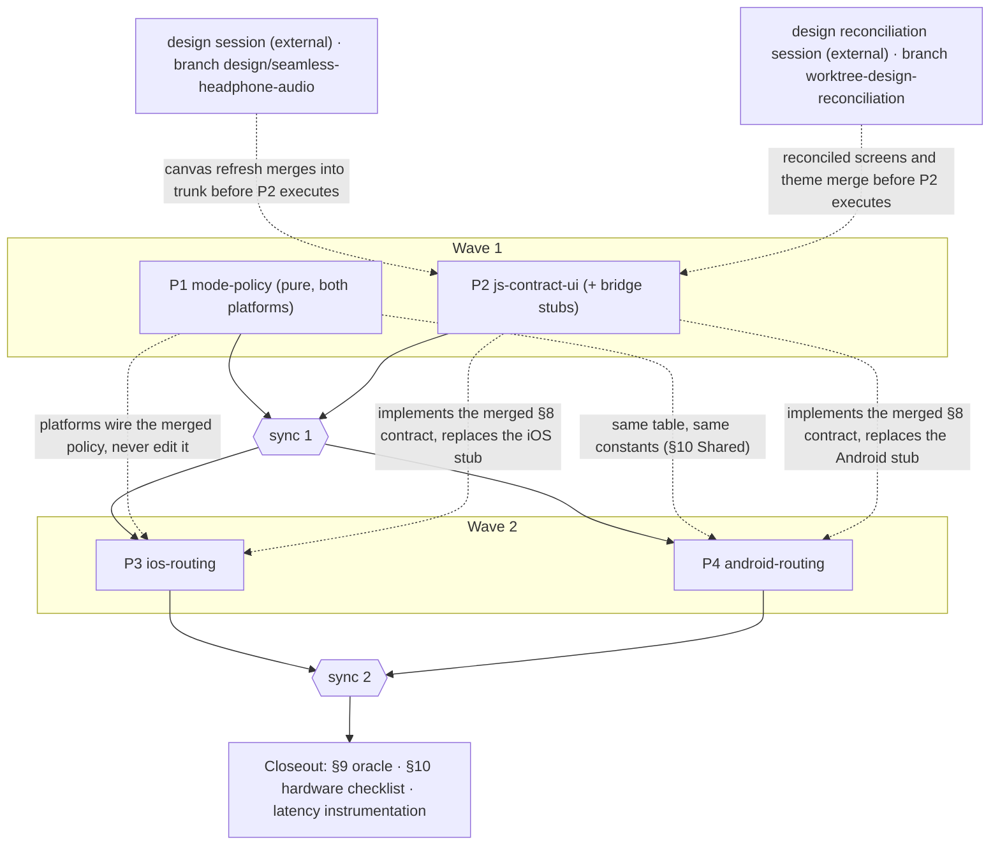

# Seamless headphone audio — execution schedule

**Spec:** docs/superpowers/specs/2026-08-18-seamless-headphone-audio-design.md
**Trunk:** feature/offline-nearby-ptt
**Run id:** 2026-08-18-seamless-headphone-audio
**Run dir:** .superpowers/waves/2026-08-18-seamless-headphone-audio/
**Models:** planner opus · executor opus · implementer sonnet · merger opus
**Dispatch model:** haiku
**Worktree setup:** pnpm install — deliberately without `pod install`: the iOS *app-workspace*
build leg runs only at merge gates in the main checkout (where `ios/Pods` exists), and the
RadioKit package tests need no Pods. A plan whose acceptance includes the app build (P2, P3)
runs `cd ios && pod install` inside its own worktree as a plan step.
**Task gate:** pnpm typecheck && pnpm lint && pnpm test <paths> · when the task touched
`android/`, plus `node scripts/build-android.js :app:testDebugUnitTest` and
`pnpm build:android` · when the task touched `ios/`, plus `cd ios/Radio &&
DEVELOPER_DIR=/Applications/Xcode.app/Contents/Developer xcodebuild test -scheme RadioKit
-destination 'platform=iOS Simulator,name=iPhone 17'`
**Merge gate:** pnpm typecheck && pnpm lint && pnpm test && pnpm build:android &&
node scripts/build-android.js :app:testDebugUnitTest && (cd ios/Radio &&
DEVELOPER_DIR=/Applications/Xcode.app/Contents/Developer xcodebuild test -scheme RadioKit
-destination 'platform=iOS Simulator,name=iPhone 17') && (cd ios &&
DEVELOPER_DIR=/Applications/Xcode.app/Contents/Developer xcodebuild -workspace Oru.xcworkspace
-scheme Oru -destination 'platform=iOS Simulator,name=iPhone 17' build)
**Flaky:** (1) first Gradle / NDK / CMake / dependency downloads are slow and can time out — a
download failure or timeout is infrastructure, not a regression; re-run once before reporting.
(2) `xcode-select` on this host points at CommandLineTools, so a *bare* `xcodebuild` fails with
a tools error — that is environment, not a regression; every xcodebuild carries the
`DEVELOPER_DIR=/Applications/Xcode.app/Contents/Developer` prefix already baked into the gates
above. (3) The `Oru` app scheme has no test action ("no test bundles available") — the RadioKit
tests run **only** from `ios/Radio`'s own package workspace; the app build and the package tests
are two separate commands, never one. (4) The simulator destination `iPhone 17` is the
recorded-working one from the 2026-08-13 spike report; if xcodebuild reports the device missing,
substitute any available iPhone simulator — device-list drift, not a regression. (5) The first
xcodebuild in a fresh worktree resolves SPM packages (google/nearby, alta/swift-opus) — a slow
first run or a transient network failure there is infrastructure; re-run once.
(6) `pnpm lingui:extract` rewrites two stale source-line references in the `*.po` catalogs —
harmless churn; commit it with whatever catalog change triggered it.

## Decomposition rationale

- The spec has four natural territories with one-way reads between them: the **§7 mode
  policy** (pure logic, no I/O), the **§8 JS/contract/UI surface**, and the two **platform
  integrations** (§5 iOS, §6 Android) that read both. Four plans, two waves, and wave 2's
  plans own disjoint directory trees (`ios/` vs `android/`), so no two plans in any wave
  write the same file.
- **The mode policy is one plan implementing it twice.** §7 demands identical constants and
  §10 demands that "each platform's tests assert the same table". One executor writing
  `ModePolicy.swift` and `ModePolicy.kt` side by side, with mirrored transition-table tests,
  makes that invariant a fact of authorship instead of a cross-team convention. Both platform
  plans *read* the merged policy and never edit it — a needed table change discovered during
  wave 2 is reported, not patched locally, because a local patch silently forks the contract.
- **The JS plan is contract-first**, the same move that worked in the prior run: the
  `audioRoute` state shape, the `audioMode` setting, the mock, and the indicator all depend
  only on §8, not on any native code. Wave 2 then implements the merged contract.
- **P2's visual authority is the local design copy in `design/`** — the Claude Design
  canvas exported verbatim at commit 29be0c2. As exported, the canvas carries nothing for
  this feature (no route/mode indicator, no audio setting), so a separate design-update
  session on branch **`design/seamless-headphone-audio`** extends the canvas
  (`01 Radio.dc.html`: the §8 indicator; `02 Settings.dc.html`: the `audioMode` row),
  pushes it back to the Claude Design project, and refreshes `design/` byte-identically.
  The indicator and the settings row are then read off the canvas files, not invented —
  the divergence the P6 UI plan already paid for once (`design/README.md`) is not
  repeated here.
- **Two external sessions are in flight, and P2 executes only after both of their branches
  merge into the trunk.** (1) The design-update session above, branch
  `design/seamless-headphone-audio` — touches only `design/`. (2) The design
  reconciliation session executing
  `docs/superpowers/plans/2026-08-18-design-reconciliation.md` on branch
  **`worktree-design-reconciliation`** — it rebuilds `src/ui/theme.ts`, the UI primitives
  and every screen to the canvas: exactly the files P2's indicator and settings row land
  in. Running P2 before that merge would put two authors into
  `RadioScreen.tsx` / `SettingsScreen.tsx` / `theme.ts` and build the indicator on screens
  about to be replaced. The two external branches touch disjoint trees (`design/` vs
  `src/`), so their merge order relative to each other does not matter. Both are external
  prerequisites of this run, like the prior run's Go decision: the runner does not
  dispatch P2's executor before both merges. P2's *plan* may be written meanwhile, and P1
  keeps wave 1 busy.
- **New coupling this run: the bridge already exists.** In the prior run the codegen spec
  could change freely because no native module implemented it yet. Now
  `specs/NativeRadio.ts` is implemented on both platforms, so P2's contract extension must
  land **with minimal native stubs on both bridges** (mechanical: accept `audioMode`, emit a
  placeholder `audioRoute`) or the sync-1 merge gate cannot compile. The stubs carry no
  routing logic; wave 2 replaces them. The bridge glue files therefore transfer ownership
  P2 → P3/P4 across sync 1, exactly like `radio.native.ts` transferred across waves in the
  prior run.
- **Each platform plan is deliberately large and serial inside.** On iOS, the session
  configurations, the four observers, the engine rebuild and the converter rebuild all touch
  `AlwaysHotBackgroundManager.swift` / `AudioEngine.swift` / `RadioEngine.swift`; on Android,
  the controller extraction and stream-survival work both touch
  `RadioForegroundService.kt` / `AudioEngine.kt` / `RadioEngine.kt`. Splitting either
  platform would put two executors into the same state machine — a collision, not
  parallelism.
- **One decision the spec leaves open, made here and reviewable:** §8 says `audioMode` is
  "persisted … passed to native" without naming the store. This schedule assigns persistence
  to the **native side** (SharedPreferences / UserDefaults), following the existing
  `PttBindingStore` precedent — no JS storage dependency exists and adding one would touch
  package.json for no benefit. P2 owns the setting's contract surface and UI; P3/P4 own its
  storage. If the operator prefers JS-side persistence, correct this before `/waves-run`.
- The §9 behavior table and the §10 hardware checklist need physical devices and are closeout
  items, not plans. The instrumentation that makes them measurable (timestamped
  device-event → audio-on-new-route log lines) is in-scope for the platform plans.

Host environment facts for the planners (agents run in fresh shells — none of this is in the
environment by default):

- macOS host; Xcode at `/Applications/Xcode.app`, but `xcode-select` points at
  CommandLineTools — every xcodebuild needs the `DEVELOPER_DIR` prefix (see **Flaky**).
- The iOS app builds **unsigned, with empty entitlements** — the PushToTalk framework was
  removed 2026-08-18; do not re-add the `com.apple.developer.push-to-talk` entitlement
  (`docs/closeout-remaining.md`). This matches the spec's non-goals.
- `scripts/build-android.js` self-resolves the Android SDK/JDK and regenerates
  `android/local.properties`; it accepts a Gradle task argument (default `assembleDebug`),
  which is how the JUnit leg `:app:testDebugUnitTest` runs.
- Android unit tests are **not** part of `pnpm test` or `pnpm build:android`; they exist only
  via Gradle, which is why both gates name them explicitly.
- Existing test corpora: `ios/Radio/Tests/RadioKitTests/` (XCTest, incl. `Fakes.swift` with
  the `BackgroundSession` fakes §10 extends) and `android/app/src/test/java/com/oru/radio/`
  (JUnit + mockito, incl. `TestDoubles.kt`, `RadioBridgeCoreTest.kt`).

## Plans

### P1 `mode-policy` — wave 1, track A
- [x] planned   → docs/superpowers/plans/2026-08-18-p1-mode-policy.md
- [x] executed  → branch plan/p1-mode-policy · worktree .claude/worktrees/p1-mode-policy
- [x] merged    → sync 1

**Owns:** the §7 mode-policy state machine as pure, I/O-free logic implemented **twice with
identical constants** — `ios/Radio/Sources/RadioKit/ModePolicy.swift` +
`ios/Radio/Tests/RadioKitTests/ModePolicyTests.swift`, and
`android/app/src/main/java/com/oru/radio/ModePolicy.kt` +
`android/app/src/test/java/com/oru/radio/ModePolicyTest.kt`: states VOICE/MEDIA; inputs
other-audio-active (debounced), radio activity, PTT press, timers via an injectable clock;
the 2 s / 30 s asymmetric hysteresis; switch-only-at-radio-idle queuing; the PTT-in-MEDIA
raise request with the 4 s grant timeout and phone-mic fallback signal, the 15 s linger, and
its exemption from the 10 s global rate limit; the `audioMode` pin semantics (`voice`/`media`
pin the profile, PTT-raise still applies inside pinned `media`); outputs as requested
profile + requested actions (raise link, play grant tone, start capture), never I/O. The §10
"Shared" requirement: the transition-table tests mirrored line for line so both platforms
assert the same table.
**Not here:** wiring inputs (other-audio detectors, route events, PTT hardware) and executing
outputs (session config apply, SCO raise, tone playback) → P3 iOS / P4 Android · the
`audioMode` setting surface and persistence → P2 (surface) and P3/P4 (storage).
**Needs:** — (first wave).
**Spec sections:** §3 D1/D2/D4, §7, §10 (Shared).
**Model override:** —

### P2 `js-contract-ui` — wave 1, track B
- [x] planned   → docs/superpowers/plans/2026-08-18-p2-js-contract-ui.md
- [x] executed  → branch plan/p2-js-contract-ui · worktree .claude/worktrees/p2-js-contract-ui
- [x] merged    → sync 1

**Owns:** the whole §8 surface: `audioRoute` (`kind`/`label`/`mode`) added to `RadioState`
in `src/radio/radio.types.ts` and mirrored in `specs/NativeRadio.ts`, published through the
existing `stateChanged` event; the `audioMode: 'auto' | 'voice' | 'media'` setting (default
`auto`) — its contract method for passing to native, its Reatom model action in
`src/radio/radio.model.ts`, its row on `SettingsScreen`; the wrapper `src/radio/radio.native.ts`;
`src/radio/radio.native.mock.ts` + `radio.mock.scripts.ts` extended so mock scenarios exercise
route changes and both modes; the compact route + mode indicator on `RadioScreen` ("AirPods ·
radio" / "AirPods · music, phone mic") and the `audioMode` row, both built **to the local
design copy in `design/`** (`01 Radio.dc.html` / `02 Settings.dc.html` as refreshed by the
merged `design/seamless-headphone-audio` branch — the canvas is the visual authority: a
value it states is read off it, never invented) and **on the reconciled UI** (the merged
`worktree-design-reconciliation` branch): tokens go through `src/ui/theme.ts` only, the
reconciliation's primitives are reused rather than duplicated, and existing `testIds` are
appended to, never renamed; all copy via lingui with filled `en`/`ru`
catalogs; JS tests for `audioRoute` propagation and the indicator (§10 JS). **Owns, also — the
compile-keeping native stubs:** minimal mechanical extensions of the existing Turbo Module
bridge glue on both platforms (the `com.oru.bridge` Kotlin module; the app-side iOS module) so
the extended codegen spec still builds — accept and store nothing, emit a placeholder
`audioRoute` (`speaker`/`voice`) — no routing logic of any kind.
**Not here:** real `audioRoute` publication and `audioMode` behavior → P3/P4 (the bridge glue
transfers to them at sync 1) · native persistence of `audioMode` (UserDefaults /
SharedPreferences per the `PttBindingStore` pattern) → P3/P4 · mode policy logic → P1 (the
indicator renders `mode`, never computes it).
**Acceptance beyond the gates:** the sync-1 merge gate's iOS app leg must compile the stub —
the executor runs `cd ios && pod install` and the app-workspace xcodebuild once in its own
worktree before reporting GREEN, since the task gate's RadioKit leg does not compile the
bridge.
**Needs:** two external branches merged into the trunk —
`design/seamless-headphone-audio` (the design session's canvas refresh) and
`worktree-design-reconciliation` (the neighbouring session executing the 2026-08-18
design-reconciliation plan; it owns `theme.ts`, the UI primitives and the screens until it
merges). Neither is a plan of this run (see the rationale). Planning may proceed before
the merges; execution may not.
**Spec sections:** §2 G5, §8, §9 (state shapes), §10 (JS).
**Model override:** —

### P3 `ios-routing` — wave 2, track A
- [ ] planned   → docs/superpowers/plans/2026-08-18-p3-ios-routing.md
- [ ] executed  → branch plan/p3-ios-routing · worktree .claude/worktrees/p3-ios-routing
- [ ] merged    → sync 2

**Owns:** everything §5, inside `ios/`: the two static session configurations (VOICE:
`.playAndRecord`/`.voiceChat`/`[.allowBluetooth, .mixWithOthers]`; MEDIA:
`.playAndRecord`/`.default`/`[.allowBluetoothA2DP, .mixWithOthers]`) applied whole,
diff-only; **deletion** of the two-phase HFP/A2DP detection, the `AudioSessionProfile`
profile enum (route formatter stays), and `setPreferredInput` pinning; the speaker override
as a pure function of current outputs — override `.speaker` only when outputs are solely
`builtInReceiver`, `.none` when any external output is present (this is the wired-headphones
fix); the four observers, all re-posted onto the `RadioEngine` queue (closing the
`isActive`/`currentProfile` race): route change (recompute override, publish route, feed
policy; `.categoryChange` → re-apply our config), **`AVAudioEngineConfigurationChange`** with
the full stop/disconnect/re-query/reconnect/restart rebuild and keep-alive tap reinstall
(formats never cached), interruption `.ended` + app-foreground recovery with `setActive`
retry (0.5 s × 3 on `isBusy`), and `mediaServicesWereReset` full teardown/rebuild; the
capture converter rebuilt on input-format change so a mid-transmission route change re-routes
instead of raising `audioFailed`; `beginIncoming` without per-transmission engine stop/start;
mode switches as profile re-apply driven by the **merged P1 policy**; other-audio detection
(`isOtherAudioPlaying` on heartbeat + route change, `silenceSecondaryAudioHint` as edge);
grant-tone playback; route→`audioRoute` classification and real publication through the
bridge per the **merged P2 contract** (replacing P2's stub — the iOS bridge glue is P3's for
this wave); `audioMode` persistence in UserDefaults; timestamped device-event →
audio-on-new-route heartbeat lines (§10 instrumentation); extended `BackgroundSession` fakes
and unit tests for every pure decision — override(route), route classification, the
(event, state)→actions reaction table (§10 iOS).
**Not here:** Android mirror → P4 · policy table or constants → merged P1 (a needed change is
reported, never patched here) · JS types, model, screens, mock → merged P2 (no `src/` or
`specs/` edits at all) · hardware checklist → closeout.
**Acceptance beyond the gates:** the executor runs `cd ios && pod install` and the
app-workspace xcodebuild once in its worktree before reporting GREEN (the task gate's
RadioKit leg does not compile the bridge glue this plan rewrites).
**Needs:** P1, P2.
**Spec sections:** §3, §4, §5, §7 (wiring), §9, §10 (iOS), §11.
**Model override:** —

### P4 `android-routing` — wave 2, track B
- [ ] planned   → docs/superpowers/plans/2026-08-18-p4-android-routing.md
- [ ] executed  → branch plan/p4-android-routing · worktree .claude/worktrees/p4-android-routing
- [ ] merged    → sync 2

**Owns:** everything §6, inside `android/`: **`AudioRouteController.kt`**, extracted from
`RadioForegroundService.kt` — dedicated `HandlerThread("audio-route")`, every callback
re-posted onto it, one idempotent `reevaluate()` (rebuild device list → pick by priority →
apply only if changed → notify only if changed), `AudioManager` behind an injected facade;
the VOICE/MEDIA profiles including the MEDIA media-path track
(`USAGE_ASSISTANCE_NAVIGATION_GUIDANCE` + `CONTENT_TYPE_SPEECH`); per-burst transient
`AUDIOFOCUS_GAIN_TRANSIENT_MAY_DUCK` (request at burst start, abandon at end) **replacing**
the session-long `AUDIOFOCUS_GAIN`; **deletion** of the `failedHeadsetKeys` blacklist in
favor of bounded per-episode retries (max 2, demotion only until the next device event,
reset on fresh connection and on detected SCO theft, ground truth re-checked via
`isAudioConnected` before declaring timeout); audio kept flowing on the previous route while
SCO / comm-device establishment is in flight (kills the ~6.3 s dead air); the new listeners —
`ACTION_AUDIO_BECOMING_NOISY` fast path, `OnCommunicationDeviceChangedListener` re-assert,
`OnModeChangedListener` **replacing** the 3 × 100 ms mode polling, `onAudioDevicesAdded`
debounced ~500 ms, the `" Watch"` product-name filter; `AudioEngine.kt` stream survival —
recreate `AudioRecord`/`AudioTrack` on applied route or profile change, reset the
consecutive-error counters on route transitions, fatal threshold only while the route is
stable; other-audio detection via `registerAudioPlaybackCallback` (own player and non-media
usages filtered) with `isMusicActive()` fallback; wiring the **merged P1 policy**;
grant-tone playback; real `audioRoute` publication and `audioMode` handling through the
bridge per the **merged P2 contract** (replacing P2's stub — the `com.oru.bridge` glue is
P4's for this wave); `audioMode` persistence in SharedPreferences; timestamped logcat
instrumentation (§10); JUnit tests against the fake facade for the full §10 Android list —
connect/disconnect/reconnect, SCO timeout + bounded retries + counter resets, debounce,
noisy, watch filter, audio-flows-while-establishing, mode-policy transitions, focus
request/abandon pairing — plus `RadioBridgeCoreTest.kt` updated for the real bridge mapping.
**Not here:** iOS mirror → P3 · policy table or constants → merged P1 (report, never patch) ·
JS types, model, screens, mock → merged P2 (no `src/` or `specs/` edits at all) · Telecom /
ConnectionService, LE Audio fast path → out of scope (§2, §12) · hardware checklist →
closeout.
**Needs:** P1, P2.
**Spec sections:** §3, §4, §6, §7 (wiring), §9, §10 (Android), §11.
**Model override:** —

## Sync 1 — after P1, P2
**Merges:** P1, P2.
**Regenerate, never text-merge:** pnpm-lock.yaml → `pnpm install`, committed separately (only
if P2 moved it — no new JS dependency is expected); lingui catalogs (`*.po`) on conflict →
`pnpm lingui:extract`, then re-fill `ru` (expect the known stale-line-reference churn, commit
it).
**Append-only surfaces:** none — P1 writes only new files under the two native radio source
trees; P2 writes `src/`, `specs/`, and the two bridge glue files, which P1 does not touch.
Any conflict at this sync is a decomposition violation and is reported as one.
**Gate:** merge gate green. This is the first sync whose gate includes the iOS legs — the
merger runs both xcodebuild commands (they last passed at the prior run's closeout) and the
Gradle JUnit leg, so any pre-existing drift on trunk surfaces here, before wave 2 builds on
it.

## Sync 2 — after P3, P4
**Merges:** P3, P4.
**Regenerate, never text-merge:** pnpm-lock.yaml → `pnpm install`, committed separately
(should not move at all this sync — if it did, a wave-2 plan edited JS dependencies it does
not own, which is reported).
**Append-only surfaces:** none — the two branches own disjoint trees (`ios/` vs `android/`),
so **any** text conflict at this sync is a decomposition violation and is reported as one.
**Cross-checks before the merge is accepted:** neither branch edited `ModePolicy.swift`,
`ModePolicy.kt`, their tests, anything under `src/`, or `specs/NativeRadio.ts` — an edit
there is a §7/§8 contract violation and is reported, not quietly merged; both platforms'
mode-policy test tables are still line-for-line mirrors.
**Gate:** merge gate green.

## Closeout

- [ ] Full merge gate on trunk from a clean checkout and a fresh `pnpm install`
      (+ `cd ios && pod install`).
- [ ] The §9 behavior-contract table executed as the acceptance oracle on physical hardware,
      both platforms, the same BT headset — every row, including the phone-call interruption
      row.
- [ ] The §10 hardware checklist: BT connect mid-receive / mid-transmit / while locked; music
      start/stop mode switches; PTT grant tone during music; headset battery death and
      return; wired plug/unplug; phone-call interruption and recovery; one OEM beyond Pixel
      (Samsung or Xiaomi) for SCO timing.
- [ ] Switch latency read from the merged instrumentation (device-event → audio-on-new-route
      timestamps in heartbeat/logcat), recorded — measured, not guessed.
- [ ] `pnpm lingui:extract` reports no missing `ru` translations.
- [ ] `docs/closeout-remaining.md` updated: the prior run's Stage 6 "Bluetooth headphones
      connected; audio route switch mid-session" item is superseded by this run's hardware
      checklist, per the spec's supersession note.

## Diagram

